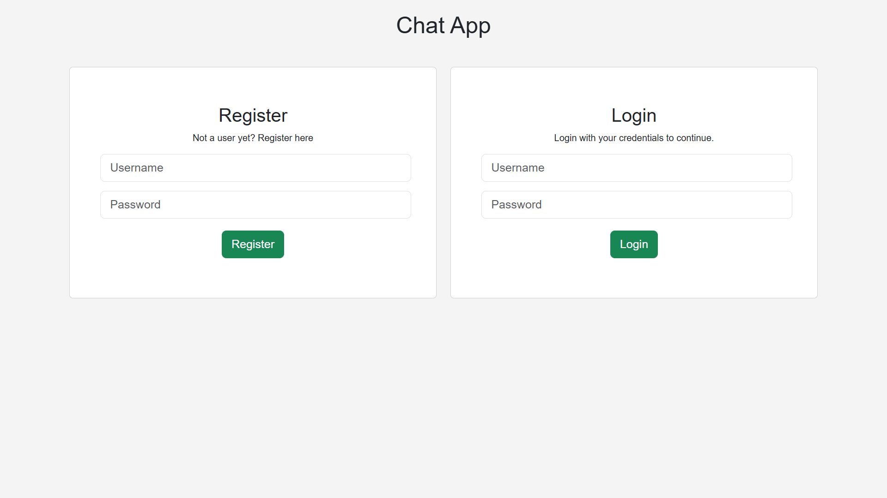
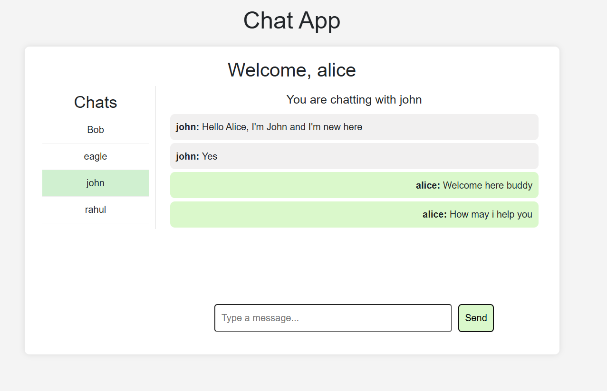
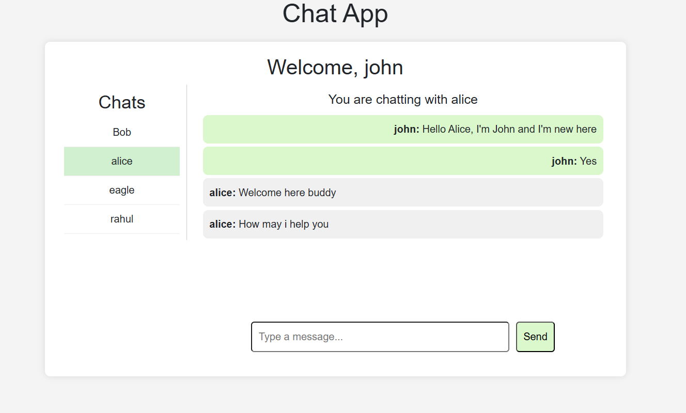

# Chat Application

## Overview

This is a real-time chat application built with **Node.js, Express.js, MongoDB, Socket.io**, and **JWT authentication**. The application allows users to register, log in, and exchange messages in real-time using WebSockets.

## Check this out




## Features

- User authentication with JWT (Register & Login)
- Secure password hashing with bcrypt
- Real-time messaging using **Socket.io**
- Database integration using **MongoDB & Mongoose**
- Fetch previous messages between users
- Fetch users excluding the current logged-in user
- CORS enabled for frontend integration

## Technologies Used

- **Node.js** - Backend runtime
- **Express.js** - Web framework for handling API requests
- **MongoDB & Mongoose** - Database for storing users and messages
- **Socket.io** - Real-time messaging via WebSockets
- **JWT (jsonwebtoken)** - User authentication
- **bcrypt** - Secure password hashing
- **dotenv** - Managing environment variables
- **Cors** - Handling cross-origin requests
- **React.js** - Frontend framework
- **Bootstrap** - Styling framework

## Installation

### 1. Clone the repository

```bash
git clone https://github.com/yourusername/chat-app.git
cd chat-app
```

### 2. Install dependencies

```bash
npm install
```

### 3. Set up environment variables

Create a `.env` file in the root directory and add the following:

```env
PORT=5001
MONGODB=your_mongodb_connection_string
JWT_SECRET=your_jwt_secret_key
```

### 4. Start the server

```bash
npm start
```

The server will start on `http://localhost:5001`

## API Endpoints

### Authentication Routes (`/auth`)

- **POST /auth/register** - Register a new user
- **POST /auth/login** - Login with username & password

### Messages Routes (`/messages`)

- **GET /messages?sender=user1&receiver=user2** - Fetch chat messages between two users

### Users Routes (`/users`)

- **GET /users?currentUser=username** - Fetch all users except the logged-in user

## WebSocket Events (Socket.io)

- `send_message` - Send a new message
- `receive_message` - Broadcast received message to other users

## Database Schema

### User Model
```js
{
  _id: ObjectId,
  username: String,
  password: String, // Hashed
  createdAt: Date,
  updatedAt: Date
}
```

### Message Model
```js
{
  _id: ObjectId,
  sender: ObjectId, // Reference to User
  receiver: ObjectId, // Reference to User
  message: String,
  timestamp: Date
}
```

## Database Design & Entity Relationship

The chat application follows a relational structure in MongoDB with the following relationships:

- **Users** have a one-to-many relationship with **Messages** (each user can send/receive multiple messages).
- **Messages** store references to **sender** and **receiver** as `ObjectId`, linking them to the `User` collection.

### Entity-Relationship (ER) Diagram:

```
  +----------------+     +----------------+
  |    Users      |     |   Messages     |
  +----------------+     +----------------+
  | _id (PK)      |◄────| _id (PK)       |
  | username      |     | sender (FK)    |
  | password      |     | receiver (FK)  |
  | createdAt     |     | message        |
  | updatedAt     |     | timestamp      |
  +----------------+     +----------------+
```

This design ensures that each message is linked to a sender and a receiver, making it easier to retrieve chat histories efficiently.


## Frontend Integration

To integrate the backend with a React frontend, follow these steps:

### 1. Clone the frontend repository (or create a new React app)
```bash
git clone https://github.com/yourusername/chat-app-frontend.git
cd chat-app-frontend
npm install
```

### 2. Update API URLs in React components
Ensure your API requests in React use the correct backend URL (`http://localhost:5001`). Example:

```js
const { data } = await axios.get("http://localhost:5001/users", {
  params: { currentUser: user.username },
});
```

### 3. Install dependencies for React frontend
```bash
npm install axios socket.io-client bootstrap react-router-dom
```

### 4. Start the React frontend
```bash
npm start
```
## License

This project is open-source and available under the **MIT License**.

---

